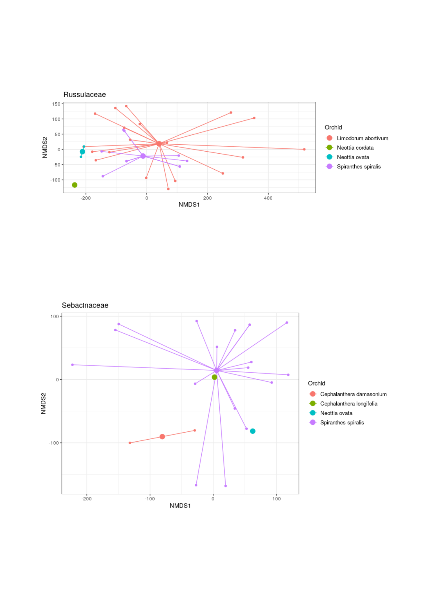
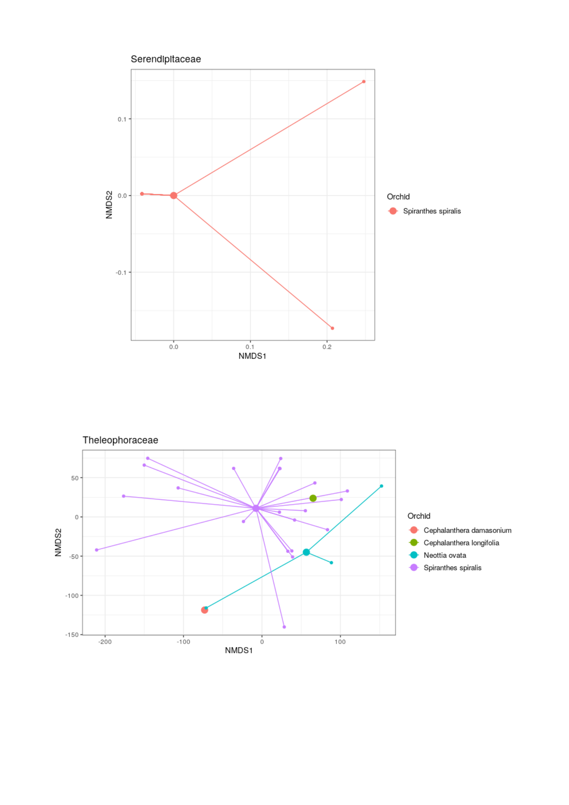
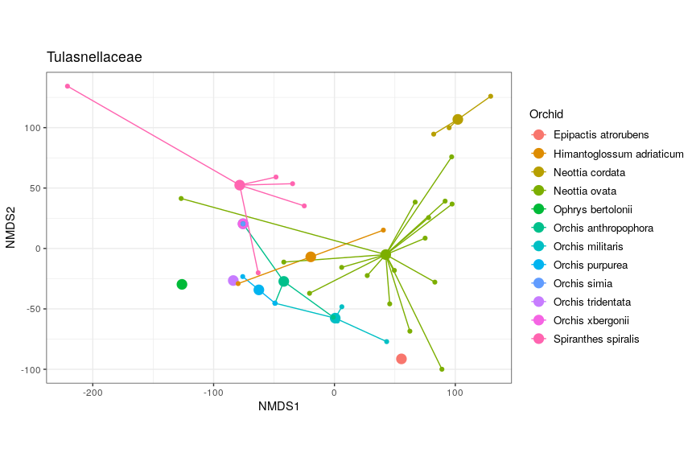
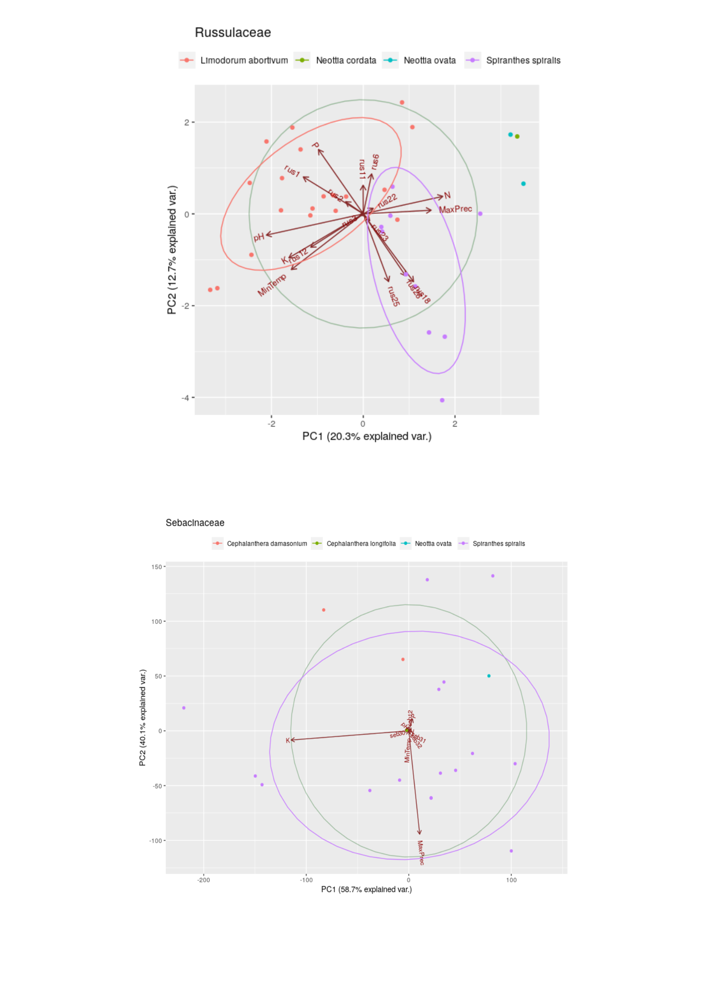
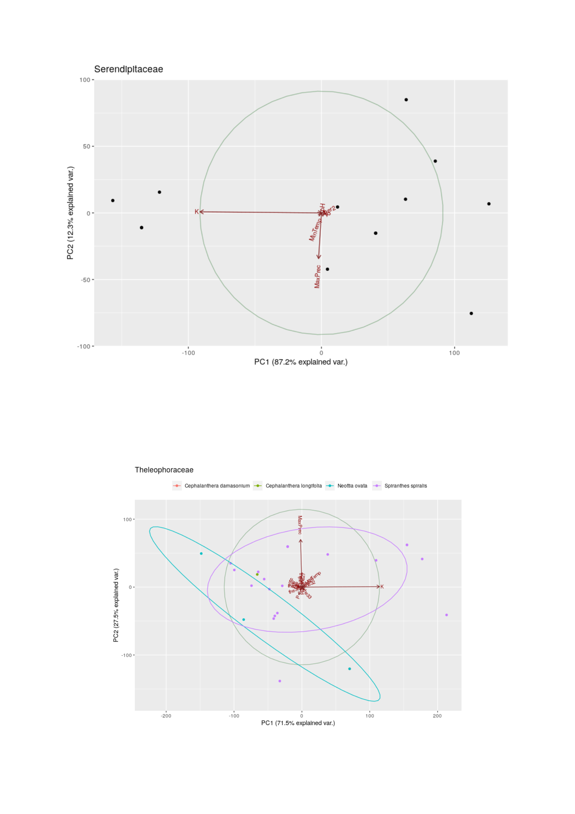
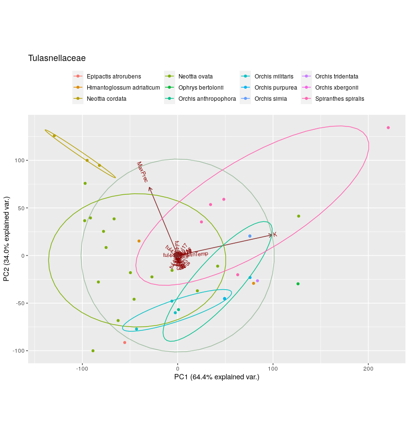

## Additional resources and information

All of the datasets, scripts and resources to reproduce the analysis are available at https://github.com/arteteco/FunModels

The logo of the university in the frontispiece is trademark by Università degli Studi di Napoli Federico II - Corso Umberto I 40 - 80138 Napoli (contactcenter@unina.it, PEC: ateneo@pec.unina.it)

Base satellite map on page 16 is ©2021 TerraMetrics, Map data ©2021GeoBasis-DE/BKG (©2009), Google, Inst Geogr. Nacional

## Analysis results

The following graphs are the phylogenetic trees, NMDS and PCA plots

 

