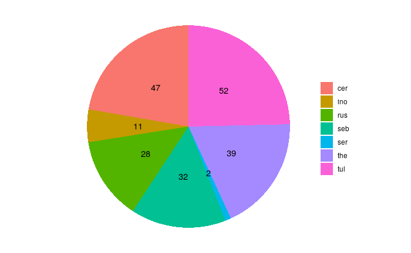

## Hypothesis

The hypothesis tested in the present work is twofold and can be summarized in the following questions
* **Do OMFs taxa from different families occour in different habitats**? We know that different families tend to be more common in different areas but the relative importance of the environmental factors, biotical and abiotical, is still in large part unclear.
* **Do OMFs belonging to the same family occur in different habitats?** Even if different families occour in different habitats, what's the distribution of each family, and what are the most important factors that may enable us to predict their presence?

## Importance of phylogenetic relationships

In order to understand the distribution and ecology of the OMFs we need to get a better insight of their phylogenesis. In general, mycorrhizal associations are the norm in the plant kingdom, and up to 80% of plant N and P is provided by mycorrhizal fungi (van der Heijden et al. 2015). This symbiotic relationship is one of the oldest and most important in the Plant Kingdom, and shedding light on the phylogenesis of the OMFs can help us understand the evolution of orchids, their distribution and ecology.

## Selected Variables

-

## Performed analysis

### Phylogenetic analysis

The phylogenetic analysis were performed on the sequences deposited by the various papers included in the database.
The **primers** used were mainly ITS1F, ITS4, ITS3 and ITS4OF, all targeting **regions** between the 18S rRNA subunit and the 28S rRNA subunit, including the Internal Transcribed Spacers (ITS hereafter) 1 and ITS 2. Those primers were usually universal for *Basidiomycota* or in some cases more specific for *Tulasnellaceae* (like ITS4tul) or other taxa.
Sequence `DQ520100` from *Tremiscus helvelloides* was used as outgroup.

* Sequences were aligned using the MUSCLE algorithm and manually trimmed to a visually satisfying overlapping
* Ugene was used as main GUI, v. 37.0
* The Maximum Parsimony analysis was performed using TNT, v. 1.1
* The MCMC was performed using MrBayes, v. 3.2.7a
* Trees were then visually edited with FigTree v. 1.4.4
* All parameters are available in the supplemental data, along with the files to reproduce the analysis.

### Multivariate analysis

Multivariate analysis, specifically Principal Component Analysis (PCA hereafter) and Non-metric Multi Dimensional Scaling (NMDS hereafter), were performed to understand both how do the OTUs from different families cluster together (if they do) and what environmental factors are most relevant.

#### Setting the data up

A few steps had to be done in order to prepare the data for the analysis

 1. Sequences have been clustered into Operative Taxonomic Units (**OTU** hereafter), by using cd-hit v. 4.8.1. This process yielded 210 OTUs.
 1. The database was then pivoted in a presence-absence matrix
 1. Using the coordinates for each point, environmental values were extracted using `GDAL`'s `Sample Raster Values` tool (Using QGIS v. 3.16 as a GUI) and appended to the dataset

Different families were differently represented in the dataset, with the extremes of _Serendipitaceae_ having two OTUs only, and _Tulasnellaceae_ 52

### PCA

The PCA was performed on the normalized dataset in two different ways:

* **splitting** the families up, so that each matrix only had all the OTUs for a single family;
* **lumping** the families up, so that for each family only a single lumping of all the presence/absences for those OTUs was used.

### NMDS

NMDS was simlarly performed on each family's OTUs and on a lumped matrix.

## Results

### Phylogenetic analysis

Probably due to the different ways the sequences were originally trimmed and obtained, the phylogenetic results were rather weak.

* The **MCMC** had rather low probability branches. Nontheless, it correctly put together the families, with the only notable exception of the _Serendipitaceae_ and _Sebacinaceae_ which were nested separately. This makes sense though, as they are both _Sebacinales_ and the _serendipitaceae_ were originally considered _sebacinaceae B_ (Weiss et al. 2004) and were only recently given a new name and properly defined (Weiss et al. 2016)
* The **Maximum parsimony analysis** was similar, but was not considered to be significative as the Branch Support was in general rather low

