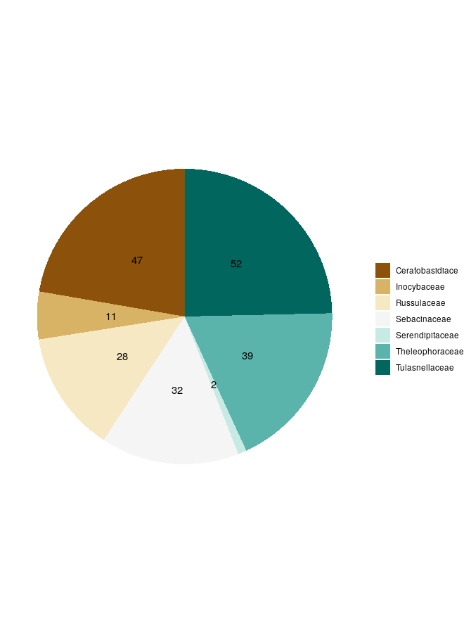

Data from bibliography regarding the distribution of OrM in Europe was collected into a starting database. The data had to be of fungi isolated from known orchid roots, and had to be georeferenced at the very least with the name of a close enough place; also, each sample had to have a genbank accession code in order to get the sequences and do the analysis.
Only sequences from well-known OrM were considered, that is: Ceratobasidiaceae, Tulasnellaceae, Inocybaceae, Serendipitaceae, Sebacinaceae, Russulaceae and Thelephoraceae [#dearnaley2012].
Orchid species sampled were *Orchis anthropophora*, *Cephalanthera damasonium* [#julou2005], *Cephalanthera longifolia* [#pecoraro2017], *Orchis simia* and *Orchis simia* [#schatz2010, lievens2010], *Orchis tridentata* [#pecoraro2012], *Orchis militaris* [#shefferson2008], *Orchis purpurea* [#lievens2010], *Himantoglossum adriaticum* [#pecoraro2013], *Limodorum abortivum* [#girlanda2005], *Spiranthes spiralis* [#duffy2019], *Ophrys bertolonii* [#pecoraro2015], *Neottia ovata* [#hansjacquemyn2015, tesitelova2015], *Neottia cordata* [#tesitelova2015], *Dactylorhiza baltica* [#shefferson2008] and *Epipactis atrorubens* [#shefferson2008].

For each point six variables were extracted by using the ESDAC database [#esdac] and the WorldClim database [#hijmans2005]: Nitrogen, Potassium and Phosphorus soil content, soil pH, minimum temperature of the coldest quarter and maximum precipitation of the wettest month. Those variables were selected because there is evidence that mycorrhizal fungi are very sensitive to nutrients in the soil: Nitrogen, Phosphorus and Potassium in high quantities (such as in eutrophicated soils because of agricultural fertilizers) have been seen to cause decline in the belowground mycorrhizal fungi species richness and cause dramatic changes in the community composition and structure [#lilleskov2002, baar2002, grant2011]. Mycorrhizal fungi growth and community composition also seem to be influenced by the soil pH [#aarle2002, carrino-kyker2016], temperature and precipitation [#rillig2003]. That's not all though: those variables may serve as important proxy for other conditions. Biomes and vegetation are correlated with the environmental condition, both because they change said conditions (like soil pH) and because all species have a range of tolerance. Also, human impact can often be seen by the amount of chemicals in the soil, especially close to cultivated fields.
Environmental values were extracted using `GDAL`'s `Sample Raster Values` tool (Using QGIS v. 3.16 as a GUI) and appended to the dataset

## Phylogenetic analysis

In order to understand the distribution and ecology of the OrM we need to get a better insight of their phylogenesis. The hypothesis was for sequences of the same family to be clustered together, with some doubts with the Sebacinales as Serendipitaceae and Sebacinaceae are very close and only recently separated [#weiss2016].
The phylogenetic analysis were performed on the sequences deposited by the papers included in the database.
The primers used were mainly ITS1F, ITS4, ITS3 and ITS4OF, all targeting regions between the 18S rRNA subunit and the 28S rRNA subunit, including the Internal Transcribed Spacers (ITS hereafter) 1 and ITS 2. Those primers were usually universal for Basidiomycota or in some cases more specific for Tulasnellaceae (like ITS4tul) or other taxa.
Sequence `DQ520100` from *Tremiscus helvelloides* was used as outgroup.

* Sequences were aligned using the MUSCLE algorithm [#edgar2004] and manually trimmed to a visually satisfying overlapping;
* Ugene was used as main GUI, v. 37.0 [#okonechnikov2012];
* The Maximum Parsimony analysis was performed using TNT, v. 1.1 [#tnt], using the Tree Bisection and Reconnection algorhithm and with ten replics. 1000 trees were kept and a strict consensus tree was calculated. A bootstrap was performed on the tree with 200 replications to test the validity of the tree. Bootstrap values are displayed as node labels in the appendix tree;
* the Bayesian analysis (MCMC) was performed using MrBayes, v. 3.2.7a [#huelsenbeck2001], using the Hasegawa-Kishino-Yano with a gamma rate heterogeneity among sites (`lset nst=2 rates=gamma;`). One million trees were generated and sampled each thousand, with four chains running. A final consensus tree was then calculated (see appendix).
* Trees were then visually edited with FigTree v. 1.4.4.
* All parameters are available in the supplemental data, along with the files to reproduce the analysis.

## Multivariate analysis

Before proceeding with the multivariate analysis, sequences have been clustered into Operative Taxonomic Units (OTU hereafter), by using cd-hit v. 4.8.1 [#li2001]. This process yielded 210 OTUs, with the extremes of Serendipitaceae having two OTUs only, and Tulasnellaceae 52 OTUs. 
The database was then pivoted in a presence-absence matrix, and for further analysis it was splitted by family, so that each matrix only had all the OTUs for that single family, yielding 7 different matrices. This was necessary to test what internal variability each family has; another matrix was obtained by grouping together all the observations from the same family, to test what the variability between the different families is. 

 

A final matrix was obtained by using the single Families/OTUs as rows and removing the orchid species variable. This was done to understand the  impact of the environmental variables only on each OTU, therefore trying to understand how different the realized niche (i.e. the variance in the environmental variables) is between the groups.

Principal Component Analysis (PCA hereafter) is an orthogonal linear transformation of the data that aims to maximize the variance of the scalar projection of all points of a dataset into a number of axis ordinated by explained variance. This yields a set of axis, which can be used for clustering, to reduce the number of dimensions and so on. PCA was performed on all matrices using the base R functions `princomp()`, which takes into account the covariance matrix and applies an eigen method of spectral decomposition when possible. Only in the case of Russulaceae, when the number of observation was too limited, `prcomp()` was used, which does a single value decomposition on the centered and scaled data matrix.

As of clustering, Non-metric Multi Dimensional Scaling (NMDS) is another widely used method that allows to visualize the level of similarity of individuals in a dataset. In contrast with PCA, it's non-linear and it's based on a distance matrix, computed by different algorithms depending on the data. It works better with non-parametric data, such as the present one. NMDS was performed on all the matrices by using the R package vegan [#dixon2003a], to understand both how do the OTUs from different families cluster together (if they do) and what environmental factors are most relevant; the Euclidean distance method was used.

In both the PCA and the NMDS we have taken into account how each OTUs presence was influenced by environmental factors, such as climate and soil conditions, and how do they cluster together. 
Species Distribution Models (SDM hereafter) is another conceptual framework we can use to disentangle the assembly processes that lead to the community as we can observe from the data we have, and to infer the relative importance of the environmental factors. SDMs are numerical tools that combine observations of species occurrence or abundance with environmental estimates. They are used to gain ecological and evolutionary insights and to predict distributions across landscapes, sometimes requiring extrapolation in space and time [#elith2009]; those models can also inform us of how species‐to‐species associations depend on the environmental context, in a Joint Species Distribution Model which oftentimes outperforms simple SDMs especially with sparse data [#pollock2014, tikhonov2017].

In the present work, a kind of JSDM called Hierarchical Model of Species Community (HMSC) [#ovaskainen2017] was performed by using the `Hmsc` package in R, v. 3.0.9 [#tikhonov2020, hmsc-r2021]; this method uses a bayesian framework to find the best fitting model based on the data, and works very well with presence-absence data as well as with environmental data [#hefley2016].
Three parallel chains were run, sampling every 500 results. Regression was done with a probit model (probability + unit), a non-linear model where the dependent variable can only take two values, which was particularly apt for this dataset because of the binary nature of the presence-absence matrix.
Using this framework, a plot with the species responses to environmental covariates (beta parameters) was produced, with at least a 85% posterior probability of being positive (red) or negative (blue).
In addition, by using the presence-absence matrix, a correlation plot between the OTUs was established, looking at the positive associations with a statistical support of at least 85% shown in red and negative associations shown in blue.

