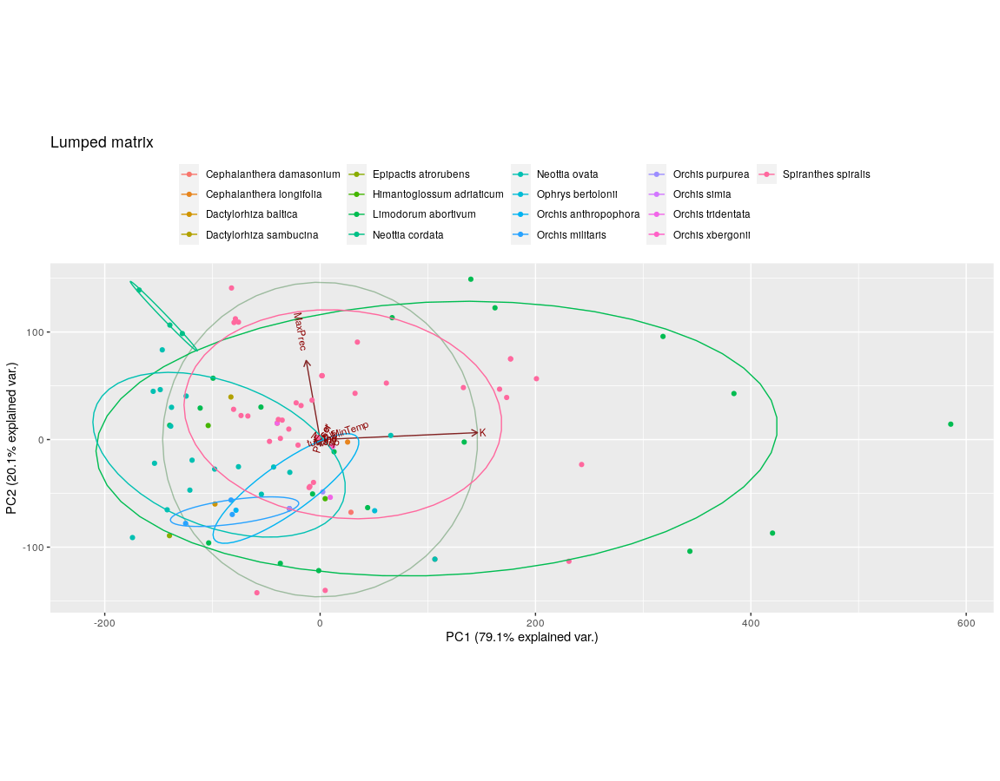
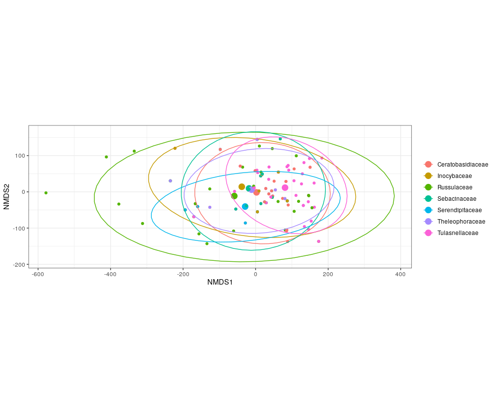
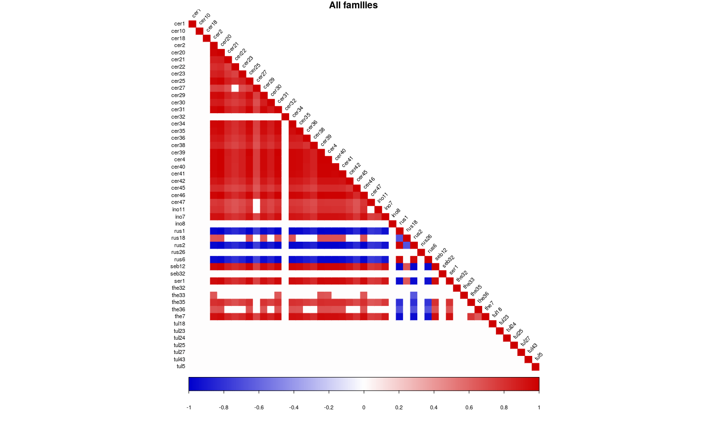
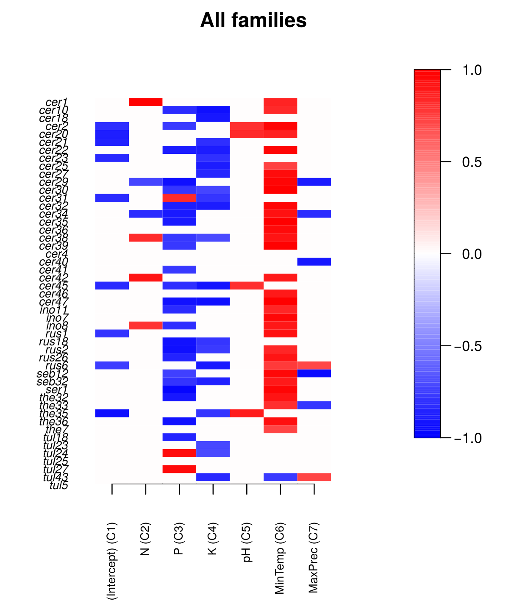

## Phylogenetic analysis

The Bayesian analysis yielded low probability branches. Nonetheless, it correctly identified OrM families, with the only notable exception of the Serendipitaceae and Sebacinaceae which were nested separately. Both Sebacinales and the Serendipitaceae were originally considered Sebacinaceae B [#weiss2004] and were only recently given a new name and properly defined [#weiss2016].
The Maximum parsimony analysis gave similar results, with bootstrap support as low as two.

## PCA

The PCA analysis on the presence-absence matrix and the environmental variables combined showed how there is a substantial overlap of realized niche in the OTUs isolated from different orchids, without distinguishable clusters except for the Tulasnellaceae isolated from *Neottia cordata*.
In all cases, the variance was well explained by the first two components (over 95% explained variance), with two variables bearing most of the loading: maximum precipitation of the wettest month and potassium content in the soil.

The PCA done using the condensed family matrix yielded the same results, with the notable exception of the *Limodorum abortivum*, which showed high variance.

## NMDS
The NMDS analysis on the individual OrM families seems to show that there is no differentiation in the OTUs found in different orchid species.
Again, Tulasnellaceae seem to be the exception, with more distinct groups for different orchid hosts; while this could be a bias caused by the higher number of samples, Ceratobasidiaceae and Theleophoraceae did not show this pattern even though the sample amount where roughly similar. This could point to a higher specialization of the Tulasnellaceae group, confirming previous observations [#dearnaley2007].
The NMDS comparing the families yielded only a partial overlapping clustering, which could indicate that different orchids may have different degrees of specialization and realized niche; *Limodorum abortivum* seemed to exibit the highest diversity, together with *Spiranthes spiralis*. 

Removing orchid species from the NMDS analysis and only looking at how different OrM families clustered based on the environmental conditions showed an unexpected pattern. Russulaceae seemed to have a high variance, which points to a broader realized niche, compared to all other families; Tulasnellaceae, which is the most sampled and abundant OrM in the dataset, had less than half the variance and clustered in an area comparable to Sebacinaceae. 

## Hierarchical modelling of species communities

The calculated Joint species distribution modelling in HMSC had a high AUC (over 0.8), which means is robust. The AUC (Area Under the Roc Curve) provides an aggregate measure of performance across all possible classification thresholds. One way of interpreting AUC is as the probability that the model ranks a random positive example more highly than a random negative example. The AUC ranges from 0 to 1. A model whose predictions are 100% wrong has an AUC of 0.0; one whose predictions are 100% correct has an AUC of 1.0.

In the correlation between the families seemed like most families had a positive correlation, with two exceptions: Tulasnellaceae, who had no correlation (0) and Russulaceae, that had a negative correlation (-1). OTUs from the same families seemed, on the other hand, to have no correlation with the others, positive or negative. This stands true for all families but Ceratobasidiaceae, which had more complex correlations, both positive and negative. Whether this is phylogenetically related is to be understood. 

The second HMSC result is the correlation between the groups and the environmental variables.
The difference between the families wasn't very pronounced, and the most relevant parameter seemed the Minimum Temperature, which was highly correlated with most  families (only Tulasnellaceae had 0 correlation), confirming the importance of this environmental parameter in understanding the distribution of OrMs. Maximum precipitation was also invertedly correlated with most families, except for Russulaceae which showed a positive correlation. Of all the soil parameters, pH seemed the most important with a general inverse correlation (the lower the pH, the higher the presence of the OrM). 
The differences between OTUS from the same families were less clear-cut, showing different correlations for different OTUs in the same family, giving an idea of the diversity that can happen also at low taxonomic levels.
It's worthy of notice that Tulasnellaceae showed again the least amount of internal differences, with Ceratobasidiaceae being at the opposite side of the spectrum.

The last HMSC result is how the variance of the environmental variables is distributed in each OTU. The minumum temperature of the coldest quarter usually has the higher variance

